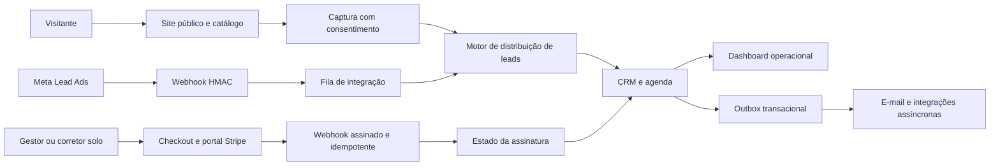

# Arquitetura do Kaptei

## Objetivo do produto

O Kaptei converte tráfego em leads imobiliários, distribui e acompanha esses leads no CRM, organiza imóveis e visitas e monetiza o acesso por assinatura. Cada conta SaaS é um tenant isolado.

## Limites de responsabilidade

- Domínio: entidades, regras e contratos; não conhece HTTP, Stripe ou PostgreSQL.
- Serviços: orquestram casos de uso e validações de negócio.
- Portas: contratos para repositórios, e-mail e pagamento.
- Adaptadores: traduzem HTTP, SQL e APIs externas para as portas.
- Composição: o roteador instancia dependências e aplica middlewares.
- Frontend: páginas coordenam fluxos; componentes, serviços, hooks e utilitários concentram comportamento reutilizável.

## Fluxos concluídos

1. Autenticação local e Google, sessão em cookie HttpOnly e recuperação de senha com token armazenado em hash.
2. Isolamento multiempresa com consultas e vínculos por `conta_id`.
3. Imóveis, fotos, clientes, interações, leads, distribuição, qualificação e agenda.
4. Site público configurável, catálogo filtrável e paginado, detalhe do imóvel, SEO e captação LGPD com atribuição UTM.
5. Checkout de assinatura hospedado, webhook validado/idempotente, atualização do plano e portal do cliente.
6. Dashboard com métricas reais, logs estruturados, request ID, recuperação de panic e trilha de auditoria de mutações.
7. Equipe com convites de uso único, limite por plano, ativação/inativação e autorização por papel.
8. Sessões revogáveis por dispositivo, versão de sessão e invalidação imediata no logout ou troca de senha.
9. Listagens internas paginadas no PostgreSQL, com busca, filtros, ordenação estável e escopo do corretor aplicado na consulta.
10. Token de integração rotacionável armazenado somente em hash e senha SMTP cifrada com AES-256-GCM.
11. Outbox transacional com payload cifrado, reserva concorrente, retentativa exponencial e encerramento gracioso; recuperação de senha e convite não dependem mais da disponibilidade imediata do SMTP.
12. Fotos gerenciadas por uma porta de armazenamento: adaptador local para desenvolvimento e S3 compatível para produção, com upload autenticado, validação por conteúdo, recodificação JPEG, miniatura e exclusão eventual pela outbox.
13. Meta Lead Ads com configuração isolada por tenant, token de página cifrado, validação HMAC-SHA256, fila persistente com `SKIP LOCKED`, consulta assíncrona ao Graph API e convergência idempotente no motor de distribuição.
14. WhatsApp Cloud API inbound com identificação por `phone_number_id`, deduplicação por `wamid`, um lead idempotente por contato, conversa contínua, janela de atendimento e conteúdo cifrado na fila e no histórico.

## Regras de evolução

- Novos provedores entram por `PaymentGateway`; não devem alterar casos de uso.
- Novos canais de lead entram por adaptadores e convergem no `LeadService`.
- Nenhuma consulta de negócio pode omitir o tenant.
- Não armazenar dados de cartão, segredos ou payloads sensíveis de auditoria.
- Componentes visuais devem reutilizar os primitivos existentes antes de criar variações.

## Próximas expansões planejáveis

- novos adaptadores de WhatsApp e portais sobre filas próprias, sem misturar eventos recebidos com a outbox de efeitos externos;
- homologação de CDN e política de ciclo de vida no provedor S3, além de antivírus externo caso outros tipos de arquivo sejam aceitos no futuro;
- renovação silenciosa de sessão de curta duração, caso a jornada futura exija;
- domínio personalizado por imobiliária, sitemap dinâmico e renderização para SEO em larga escala;
- testes automatizados de isolamento tenant, contratos HTTP e jornadas críticas;
- métricas OpenTelemetry e alertas operacionais quando houver infraestrutura de observabilidade.

## Evolução implementada em agosto de 2026

- WhatsApp Cloud API inbound e outbound: conteúdo cifrado, deduplicação por `wamid`, janela de 24 horas, templates condicionados a consentimento, status monotônicos e envio assíncrono pela outbox.
- Caixa de atendimento componentizada com autorização por tenant e por corretor responsável pelo lead.
- Motor genérico de filas compartilhado por outbox, Meta Lead Ads e WhatsApp inbound, preservando tratadores e adaptadores separados.
- Métricas HTTP, filas, backlog e pool PostgreSQL em formato Prometheus, com endpoint desativado por padrão e protegido por token cifrado.
